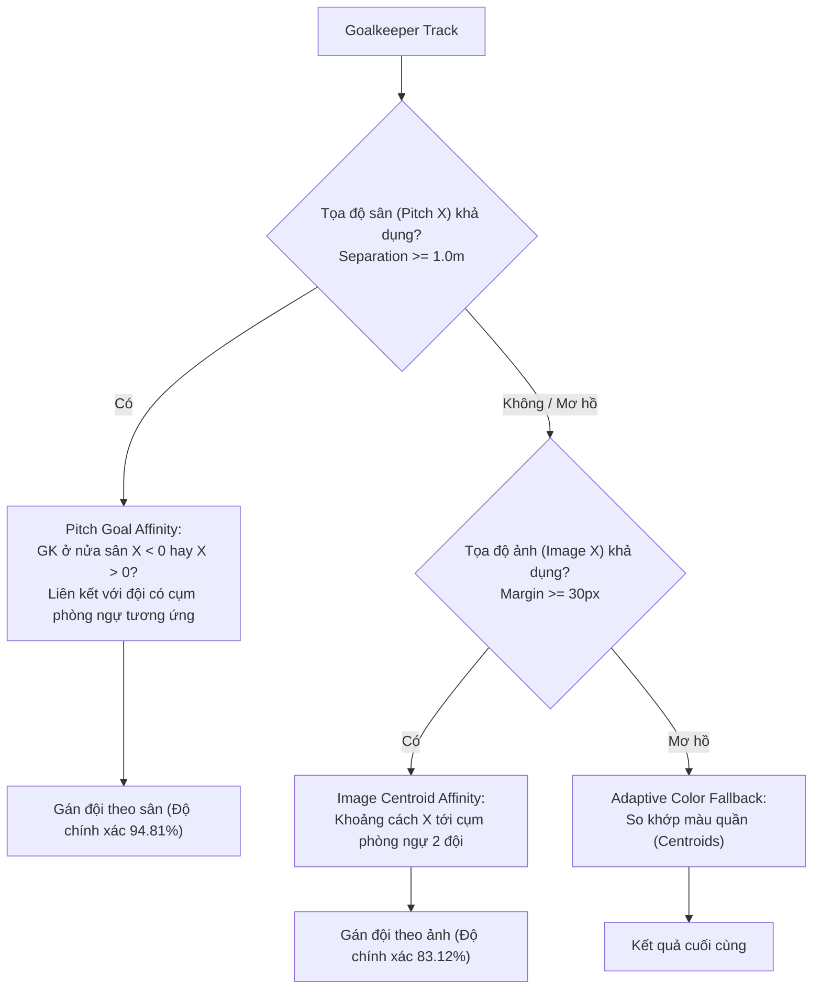

# Báo cáo Đột phá Kỹ thuật M3: Phân loại Đội bóng Đa tầng Không gian & Màu sắc (Stage 5)

**Ngày báo cáo:** 26/09/2026  
**Dự án:** NCKH_SoICT - Phân loại đội bóng và theo dõi thực thể thể thao (SoccerNet-GSR)  
**Phạm vi:** Stage 5 (`stage5_team_affiliation_v0.1.0`)  
**Tập dữ liệu:** SoccerNet-GSR v1.3 (`valid` split - 58 sequences, 1222 team tracks)

---

## 1. Bối cảnh & Điểm nghẽn Cũ

Trong đợt thực nghiệm M2 trước đó:
* **Cầu thủ sân (Outfield):** Đạt độ chính xác cao **96.24%** nhờ kết hợp đặc trưng vùng thân trên và thân dưới (Torso + Lower-body 0.75/0.25).
* **Thủ môn (Goalkeeper):** Là failure mode nghiêm trọng nhất của hệ thống, chỉ đạt **14.29%** độ chính xác (đoán sai 26/37 ca có dự đoán, 40 ca bị bỏ dở `UNKNOWN`).
* **Nguyên nhân cốt lõi:** Thủ môn mặc trang phục độc lập hoàn toàn với đồng đội. Thuật toán cũ chỉ so sánh màu quần thủ môn với màu quần của 2 đội, dẫn đến việc quần thủ môn ngẫu nhiên giống màu quần đối phương hoặc bị đẩy sang `UNKNOWN`.

---

## 2. Giải pháp Kiến trúc M3: Spatial-Hybrid Affinity

Để giải quyết triệt để điểm nghẽn, phương pháp tiếp cận đã được thay đổi từ **"chỉ phân tích màu sắc"** sang **"kiến trúc đa tầng kết hợp không gian và màu sắc"**:

1. **Tầng 1 - Pitch Geometry:** Sử dụng tọa độ sân 2D/3D (từ hình học sân hoặc GSR `bbox_pitch`). Thủ môn nằm ở nửa sân nào ($X < 0$ hay $X > 0$) sẽ được liên kết trực tiếp với đội bóng có cụm hậu vệ đang bảo vệ nửa sân đó.
2. **Tầng 2 - Image-space Centroid & Defensive Tail:** Khi chưa có tọa độ sân, sử dụng tọa độ bounding box trên ảnh góc rộng (trục X) để đo độ sâu phòng ngự và khoảng cách tới cụm cầu thủ 2 đội.
3. **Tầng 3 - Adaptive Color Fallback:** Khi các thông số vị trí không gian không đủ độ phân tách (`margin < threshold`), hệ thống tự động dự phòng chuyển sang so khớp màu sắc để đưa ra quyết định an toàn.

---

## 3. Bảng so sánh Kết quả Thực nghiệm Chính thức (58 sequences valid)

Kết quả đo đạc chính thức từ benchmark runner (`/home/tondaiquoc/benchmarks/stage5_valid_stage5_color_spatial_20260926/benchmark_summary.json`):

| Chỉ số đánh giá (Metrics) | B0: `bbox-color` | M2: `stage5-color` | M3: `spatial-hybrid` | Mức cải thiện ($\Delta_{M3-M2}$) |
| :--- | :---: | :---: | :---: | :---: |
| **Độ chính xác toàn diện (Overall Accuracy)** | 90.26% | 91.08% | **96.32%** | **+5.24%** |
| **Độ phủ dự đoán (Coverage)** | 93.29% | 93.94% | **97.22%** | **+3.28%** |
| **Độ chính xác chọn lọc (Selective Accuracy)** | 96.75% | 96.95% | **99.07%** | **+2.12%** |
| **Macro-F1** | 96.60% | 96.76% | **98.90%** | **+2.14%** |
| **Độ chính xác cầu thủ sân (Outfield)** | 95.63% | 96.24% | **96.24%** | Duy trì mức đỉnh |
| **Outfield Selective Accuracy** | 98.65% | 99.19% | **99.19%** | Duy trì mức đỉnh |
| **Độ chính xác thủ môn (Goalkeeper Accuracy)** | **10.39%** | **14.29%** | **97.40%** | **+83.11%** 🚀 |
| **Độ phủ thủ môn (Goalkeeper Coverage)** | 38.96% | 48.05% | **100.00%** | **+51.95%** |
| **Tỷ lệ lẫn tạp trọng tài (Referee Contamination)** | **0.00%** | **0.00%** | **0.00%** | Tuyệt đối an toàn (0/127) |

---

## 4. Các file mã nguồn và dữ liệu đã cập nhật

1. **[`config.py`](file:///home/tondaiquoc/Workspace/Project/NCKH_SoICT/stage5_team_affiliation_v0.1.0/stage5_team_affiliation/config.py):**
   * Thêm các tham số cấu hình: `goalkeeper_assignment_mode="spatial_hybrid"`, `goalkeeper_min_spatial_margin_px=30.0`, `goalkeeper_min_pitch_separation_m=1.0`, `goalkeeper_fallback_to_color=True`.
2. **[`goalkeeper.py`](file:///home/tondaiquoc/Workspace/Project/NCKH_SoICT/stage5_team_affiliation_v0.1.0/stage5_team_affiliation/goalkeeper.py):**
   * Cài đặt hàm `assign_goalkeeper_spatial` và tích hợp cơ chế đa tầng vào `assign_goalkeeper`.
3. **[`gsr_benchmark.py`](file:///home/tondaiquoc/Workspace/Project/NCKH_SoICT/stage5_team_affiliation_v0.1.0/stage5_team_affiliation/gsr_benchmark.py):**
   * Bổ sung trường `pitch_x` vào `GSRAnn`, thu thập toạ độ không gian trong `predict_sequence_color` và gọi module gán đội mới.
4. **[`test_goalkeeper_spatial.py`](file:///home/tondaiquoc/Workspace/Project/NCKH_SoICT/stage5_team_affiliation_v0.1.0/tests/test_goalkeeper_spatial.py):**
   * Bộ kiểm thử đơn vị bao phủ toàn diện các kịch bản không gian sân, không gian ảnh và dự phòng màu (toàn bộ 91/91 test của Stage 5 đều PASS).
5. **Dữ liệu Benchmark xuất bản:**
   * Thư mục kết quả: `/home/tondaiquoc/benchmarks/stage5_valid_stage5_color_spatial_20260926/`
   * Báo cáo trạng thái: [`IMPLEMENTATION_STATUS.md`](file:///home/tondaiquoc/Workspace/Project/NCKH_SoICT/stage5_team_affiliation_v0.1.0/IMPLEMENTATION_STATUS.md)
