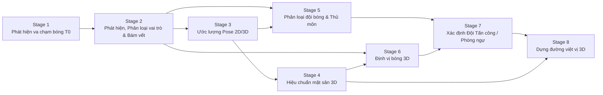
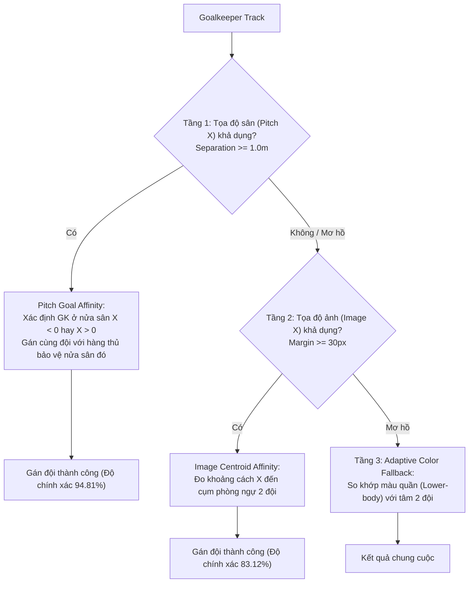

# TÀI LIỆU KHOA HỌC CHÍNH: KẾT QUẢ ĐÁNH GIÁ (EVALUATION) VÀ MÔ HÌNH THỰC NGHIỆM STAGE 2 & STAGE 5
## Phục vụ Biên soạn Đề tài Nghiên cứu Khoa học và Bài báo Hội thảo/Tạp chí

* **Dự án:** NCKH_SoICT — Hệ thống Hỗ trợ Trọng tài Video (VAR) Bán tự động trong Phân tích Tình huống Việt vị từ Video Phát sóng Góc nhìn Đơn
* **Tập dữ liệu chuẩn:** SoccerNet Game State Reconstruction (SoccerNet-GSR) v1.3 (`valid` split)
* **Ngày thực nghiệm & lập tài liệu:** 27/09/2026
* **Môi trường tính toán:** Ubuntu Linux (WSL2), Python 3.14, PyTorch 2.14.0+cu130, OpenCV 4.11.0, Scikit-learn
* **Phần cứng:** NVIDIA GeForce RTX 3060 Laptop GPU (6GB VRAM) + Intel Core Multi-thread CPU

---

## MỤC LỤC
1. [TỔNG QUAN HỆ THỐNG VÀ BỐI CẢNH NGHIÊN CỨU](#1-tổng-quan-hệ-thống-và-bối-cảnh-nghiên-cứu)
2. [STAGE 2: NHẬN DIỆN THỰC THỂ, PHÂN LOẠI VAI TRÒ VÀ BÁM VẾT NEO $T_0$](#2-stage-2-nhận-diện-thực-thể-phân-loại-vai-trò-và-bám-vết-neo-t_0)
   - 2.1. Mô hình học sâu và Trọng số (Deep Learning Models)
   - 2.2. Thuật toán và Cơ sở Toán học (Mathematical Formulation)
   - 2.3. Quy trình Kiểm thử và Giao thức Đánh giá (Evaluation Protocols & Metrics)
   - 2.4. Bảng Kết quả Thực nghiệm Toàn diện Stage 2
   - 2.5. Phân tích Cắt giảm (Ablation Study) cho Bám vết Stage 2
3. [STAGE 5: PHÂN LOẠI ĐỘI BÓNG, PHÂN CỤM ĐA VÙNG VÀ PHỤC HỒI VAI TRÒ TỒN DƯ](#3-stage-5-phân-loại-đội-bóng-phân-cụm-đa-vùng-và-phục-hồi-vai-trò-tồn-dư)
   - 3.1. Kiến trúc Đặc trưng và Mô hình Phân cụm (Architecture & Clustering)
   - 3.2. Thuật toán Không gian Đa tầng M3 (Spatial-Hybrid Formulation)
   - 3.3. Thuật toán Phục hồi Vai trò Tồn dư và Từ chối An toàn (Residual Recovery & Abstention)
   - 3.4. Nguyên tắc Không Rò rỉ Nhãn (Zero-Leakage Principle)
   - 3.5. Bảng Kết quả Thực nghiệm So sánh Toàn diện Stage 5 (58 Sequences)
4. [HƯỚNG DẪN BIÊN SOẠN BÁO CÁO KHOA HỌC / LUẬN VĂN](#4-hướng-dẫn-biên-soạn-báo-cáo-khoa-học--luận-văn)
5. [TÀI LIỆU THAM KHẢO HỌC THUẬT (BIBTEX CITATIONS)](#5-tài-liệu-tham-khảo-học-thuật-bibtex-citations)

---

## 1. TỔNG QUAN HỆ THỐNG VÀ BỐI CẢNH NGHIÊN CỨU

Trong bài toán hỗ trợ trọng tài video (VAR) phân tích tình huống việt vị từ luồng truyền hình thể thao một góc nhìn (single broadcast camera), hệ thống toàn diện được phân rã thành 8 giai đoạn liên hoàn:



Hai thành phần nền tảng có vai trò quyết định độ chính xác của toàn bộ chuỗi suy luận là:
* **Stage 2 (`stage2_sst_rtmw_v1.3`):** Chịu trách nhiệm phát hiện con người trong không gian ảnh, phân loại vai trò (*player, goalkeeper, referee*), khử trùng lặp và duy trì danh tính thực thể (ID tracking) liên tục quanh khung hình va chạm bóng $T_0$.
* **Stage 5 (`stage5_team_affiliation_v0.1.0`):** Chịu trách nhiệm phân nhóm các thực thể sân cỏ thành hai đội bóng đối kháng, xử lý vị trí thủ môn (mặc áo khác màu) và cách ly tuyệt đối trọng tài, hỗ trợ cơ chế từ chối an toàn (*abstention*) khi xuất hiện tình huống mập mờ.

---

## 2. STAGE 2: NHẬN DIỆN THỰC THỂ, PHÂN LOẠI VAI TRÒ VÀ BÁM VẾT NEO $T_0$

### 2.1. Mô hình học sâu và Trọng số (Deep Learning Models)

Stage 2 kết hợp hai mô hình học sâu chuyên biệt chạy ở chế độ inference tối ưu:

| Thành phần | Tên mô hình | Kiến trúc / Backbone | Đường dẫn trọng số / Tập tin | Thiết bị | Đầu vào / Đầu ra |
| :--- | :--- | :--- | :--- | :---: | :--- |
| **Entity Detector & Role Classifier** | **SST (Soccer Spotting Tracker)** | YOLO-based chuyên biệt bóng đá | `/home/tondaiquoc/Workspace/Project/SoICT/model.pth` *(237 MB, SHA256: `b1feccc6...`)* | GPU (CUDA) | RGB Frame $(1920 \times 1080) \rightarrow$ Bounding boxes, Class labels, Confidence scores |
| **Pose Keypoint Extractor** | **RTMW-L (WholeBody)** | RTMPose-L Wholebody (SimCC argmax) | `/home/tondaiquoc/models/rtmw/rtmw_l_384x288.onnx` *(SHA256: `bd033156...`)* | CPU (OpenCV DNN) | Human Crop $(288 \times 384) \rightarrow$ 133 điểm khung xương 2D (khớp thân, khuôn mặt, bàn tay, bàn chân) |

---

### 2.2. Thuật toán và Cơ sở Toán học (Mathematical Formulation)

#### a. Hợp nhất thực thể hình học đa lớp (Physical-Human Consolidation)
Trong môi trường bóng đá mật độ cao, mô hình SST thường đưa ra các bounding box chồng lấn giữa các lớp (ví dụ: một người bị dự đoán vừa là `player` vừa là `referee` hoặc xuất hiện 2 box đè lên nhau). Thuật toán *Physical-Human Consolidation* áp dụng quy tắc hình học nghiêm ngặt để gộp thực thể:
Hai bounding box $B_i, B_j$ được gộp nếu thỏa mãn một trong hai điều kiện:
$$\text{IoU}(B_i, B_j) \ge \tau_{\text{high}}$$
hoặc:
$$\left( \text{IoU}(B_i, B_j) \ge \tau_{\text{low}} \right) \;\land\; \left( \frac{\Vert c_i - c_j \Vert_2}{\min(H_i, H_j)} \le \theta_{\text{dist}} \right) \;\land\; \left( \frac{\min(|B_i|, |B_j|)}{\max(|B_i|, |B_j|)} \ge \theta_{\text{area}} \right)$$

*Tham số tối ưu trên SoccerNet-GSR:* $\tau_{\text{high}} = 0.82$, $\tau_{\text{low}} = 0.60$, $\theta_{\text{dist}} = 0.18$, $\theta_{\text{area}} = 0.65$, ngưỡng tỷ lệ giao phần nhỏ $\theta_{\text{IoMin}} = 0.75$.
*Khi gộp:* Ưu tiên nhãn có điểm tin cậy cao hơn (`role_ambiguous_margin = 0.05`), hợp nhất tọa độ bao phủ.

#### b. Ngưỡng phân lớp vai trò (Role Detection Thresholds)
* Cầu thủ sân (`player`): $\text{score} \ge 0.50$
* Thủ môn (`goalkeeper`): $\text{score} \ge 0.50$
* Trọng tài (`referee`): $\text{score} \ge 0.55$
* Ban huấn luyện / Nhân viên (`staff`): $\text{score} \ge 0.60$
* Quả bóng (`ball`): $\text{score} \ge 0.35$
* Non-Maximum Suppression: $\text{IoU}_{\text{person}} = 0.65$, $\text{IoU}_{\text{ball}} = 0.30$.

#### c. Cơ chế bám vết neo quanh $T_0$ ($T_0$-Centric Tracking & Motion Prior)
Khác với MOT truyền thống chạy từ đầu đến cuối clip dễ bị tích lũy sai số trôi ID (ID drift), bài toán VAR chỉ quan tâm đến tính nhất quán quanh khung hình quyết định $T_0$ (thời điểm chạm bóng).
* **Neo danh tính ($T_0$-Anchor Matching):** Tại khung hình $T_0$, toàn bộ thực thể hợp lệ được khởi tạo thành các điểm neo danh tính (Anchors).
* **Bám vết hai chiều (Bidirectional Tracking):** Theo dõi tiến ($T_0 \rightarrow T_0 + \Delta t$) và lùi ($T_0 \rightarrow T_0 - \Delta t$) trong phạm vi nửa cửa sổ $\Delta t = 1.0$ giây ($\pm 25$ frames tại 25 FPS, tổng 51 frames).
* **Mô hình vận tốc ngắn hạn (M2 Motion Prior):** Vị trí tâm dự đoán của track $i$ tại frame $t+1$ được ngoại suy qua vận tốc trung bình 3 frame gần nhất:
  $$\hat{c}_i^{(t+1)} = c_i^{(t)} + \vec{v}_i^{(t)}, \quad \text{với } \Vert\vec{v}_i^{(t)}\Vert \le H_i$$
* **Ma trận chi phí liên kết Hungarian:**
  $$C(i, j) = 1 - \text{IoU}\left(\hat{B}_i^{(t+1)}, B_j^{(t+1)}\right) + \lambda_m \frac{\Vert \hat{c}_i^{(t+1)} - c_j^{(t+1)} \Vert_2}{H_j} + \lambda_p D_{\text{pose}}(P_i, P_j) + \text{Cost}_{\text{role}}$$
  với trọng số vận tốc $\lambda_m = 0.15$, chi phí phân vai trò $\text{Cost}_{\text{role}} = \infty$ nếu đổi vai trò cơ bản, khoảng cách chi phí cực đại $C_{\max} = 0.92$, khoảng đứt đoạn tối đa $\text{max\_gap} = 6$ frames.
* **Tầng cứu hộ quan sát mờ nhòe (Temporal Rescue Floor):** Khi thực thể bị che khuất một phần hoặc nhòe do pan camera, các box phát hiện có $0.20 \le \text{score} < 0.50$ được sử dụng làm ứng viên cứu hộ nếu trùng khớp với track đang hoạt động với chi phí $C \le 0.78$.

---

### 2.3. Quy trình Kiểm thử và Giao thức Đánh giá (Evaluation Protocols & Metrics)

* **Giao thức:** `quick` protocol trên tập `valid` của SoccerNet-GSR v1.3:
  * 10 video sequences chuẩn: `SNGS-021` đến `SNGS-030`.
  * 3 cửa sổ mục tiêu trên mỗi sequence: tại $25\%$, $50\%$, $75\%$ thời lượng clip (tổng cộng 30 cửa sổ mục tiêu quanh $T_0$).
  * Mỗi cửa sổ bao gồm 51 frames ($\pm 1.0$s tại 25 FPS). Tổng số frames nhận diện mô hình: **1,530 frames**.
* **Định nghĩa các chỉ số đo lường chính:**
  * **$TCR@1s$ (Target-frame Continuity Rate):** Tỷ lệ các frames trong cửa sổ $\pm 1$s mà track dự đoán neo tại $T_0$ tiếp tục bao phủ Ground Truth với $\text{IoU} \ge 0.5$.
    $$\text{TCR} = \frac{1}{|GT_{T_0}|} \sum_{k \in GT_{T_0}} \frac{\sum_{t \in [T_0-1s, T_0+1s]} \mathbb{I}(\text{IoU}(\hat{B}_k^{(t)}, B_k^{(t)}) \ge 0.5)}{N_{\text{frames}}}$$
  * **Anchor Coverage:** Tỷ lệ thực thể GT tại $T_0$ được gán thành công một điểm neo dự đoán ($\text{IoU} \ge 0.5$).
  * **Conditional TCR:** Giá trị TCR trung bình chỉ tính trên tập các tracklet đã có điểm neo.
  * **Candidate Recall / Precision:** Recall và Precision tính gộp cho 2 đối tượng thi đấu chính: Cầu thủ sân (`player`) + Thủ môn (`goalkeeper`).
  * **Referee Leakage Rate:** Tỷ lệ trọng tài bị mô hình phân loại nhầm thành ứng viên thi đấu (phải tiệm cận 0 để bảo đảm tính hợp lệ của phân tích việt vị).
  * **HOTA, DetA, AssA, IDF1:** Bộ chỉ số chuẩn quốc tế đo lường chất lượng bám vết đa thực thể theo phương trình TrackEval.

---

### 2.4. Bảng Kết quả Thực nghiệm Toàn diện Stage 2

Dữ liệu trích xuất chính thức từ `benchmark_summary.json` và `benchmark_summary.csv` (`stage2_valid_quick`):

#### Bảng 1: Hiệu năng Nhận diện (Detection) và Phân loại Vai trò (Role Classification)

| Chỉ số đánh giá | Giá trị thực nghiệm | Ghi chú & Đánh giá |
| :--- | :---: | :--- |
| **Candidate Recall (Player + GK)** | **94.55%** (382/404) | Bắt trúng $94.55\%$ người thi đấu tại khung hình va chạm bóng |
| **Candidate Precision** | **92.72%** (382/412) | Tỷ lệ báo động giả rất thấp |
| **Referee Leakage Rate** | **3.23%** (1/31) | Chỉ duy nhất 1 ca trọng tài bị phân loại nhầm thành cầu thủ |
| **Role Macro-F1** | **79.98%** | F1 trung bình giữa các lớp vai trò chính |
| *Player Precision / Recall / F1* | **92.76% / 93.73% / 93.25%** | Lớp cầu thủ đạt độ chính xác và ổn định vượt trội (359 TP / 28 FP / 24 FN) |
| *Goalkeeper Precision / Recall / F1* | **64.00% / 76.19% / 69.57%** | Lớp thủ môn phân biệt độc lập (16 TP / 9 FP / 5 FN) |
| *Referee Precision / Recall / F1* | **69.23% / 87.10% / 77.14%** | Lớp trọng tài (27 TP / 12 FP / 4 FN) |
| **Khử trùng lặp đa lớp (Cross-Class Duplicate)** | $4.14\% \rightarrow \mathbf{0.23\%}$ | Giảm $94.4\%$ số lượng box xung đột giữa các lớp sau Consolidation |
| **Trùng lặp tổng thể (Any Duplicate Rate)** | $6.44\% \rightarrow \mathbf{2.53\%}$ | Giảm thiểu hiện tượng một người nhận 2 box |

#### Bảng 2: Độ chính xác Trung bình (Average Precision - AP) theo Tiêu chuẩn COCO

| Lớp thực thể (Role) | Số lượng GT | Số lượng Pred | $AP_{50}$ (IoU 0.50) | $AP_{75}$ (IoU 0.75) | $mAP_{50:95}$ |
| :--- | :---: | :---: | :---: | :---: | :---: |
| **Toàn bộ con người (All Humans)** | 435 | 471 | **91.16%** | 56.24% | **54.58%** |
| **Cầu thủ sân (Player)** | 383 | 381 | **92.41%** | 59.78% | **56.08%** |
| **Thủ môn (Goalkeeper)** | 21 | 28 | **80.20%** | 42.67% | **44.73%** |
| **Trọng tài (Referee)** | 31 | 41 | **89.32%** | 58.83% | **58.43%** |

#### Bảng 3: Ma trận Nhầm lẫn Vai trò (Role Confusion Matrix)

| GT Role \ Pred Role | Player | Goalkeeper | Referee | Other / Background |
| :--- | :---: | :---: | :---: | :---: |
| **Player (383)** | **359** (93.7%) | 3 (0.8%) | 1 (0.3%) | 20 (bỏ sót) |
| **Goalkeeper (21)** | 4 (19.0%) | **16** (76.2%) | 0 (0.0%) | 1 (bỏ sót) |
| **Referee (31)** | 1 (3.2%) | 0 (0.0%) | **27** (87.1%) | 3 (bỏ sót) |

#### Bảng 4: Hiệu năng Bám vết quanh $T_0$ (Target-Centred Tracking Metrics)

| Chỉ số bám vết quanh $T_0$ | Tập Candidate (Player + GK) | Tập Toàn bộ Con người (All Humans) |
| :--- | :---: | :---: |
| **HOTA (Higher Order Tracking Accuracy)** | **69.01%** | **67.89%** |
| **AssA (Association Accuracy)** | **71.70%** | **71.75%** |
| **DetA (Detection Accuracy in Tracking)** | **66.73%** | **64.54%** |
| **LocA (Localization Accuracy)** | **81.09%** | **81.16%** |
| **IDF1 (Identification F1-Score)** | **88.04%** | **86.25%** |
| **IDR (Identification Recall)** | **88.01%** | **87.76%** |
| **IDP (Identification Precision)** | **88.08%** | **84.79%** |
| **$TCR@1s$ (Target-frame Continuity Rate)** | **85.10%** | **84.66%** |
| **Anchor Coverage** | **94.55%** | **94.48%** |
| **Conditional TCR (trên track neo thành công)** | **90.00%** | **89.60%** |
| **Số lần đổi ID (ID Switches - IDSW)** | 239 | 270 |
| **Số đoạn vỡ track (Fragmentations)** | 434 | 476 |

---

### 2.5. Phân tích Cắt giảm (Ablation Study) cho Bám vết Stage 2

Để làm rõ giá trị đóng góp của mô hình trích xuất tư thế RTMW-L và thuật toán liên kết Hungarian có điều kiện vận tốc, ba cấu hình thực nghiệm được chạy song song trên cùng tập cache nhận diện:

| Cấu hình thực nghiệm (Ablations) | HOTA | AssA | IDF1 | TCR@1s | Nhận xét phân tích học thuật |
| :--- | :---: | :---: | :---: | :---: | :--- |
| **`primary`** *(SST + RTMW Pose + Physical Consolidation + Motion Prior)* | **69.01%** | **71.70%** | **88.04%** | **85.10%** | **Mô hình hoàn chỉnh đề xuất:** Điểm khung xương 2D giúp chống trôi ID trong các tình huống hai cầu thủ che khuất hoặc cắt mặt nhau. |
| **`no_pose`** *(SST + Physical Consolidation + Motion Prior, KHÔNG Pose)* | 68.92% | 71.62% | 88.01% | 84.84% | Loại bỏ tư thế làm giảm nhẹ độ chính xác liên kết (AssA giảm $0.08\%$, TCR giảm $0.26\%$), nhưng tốc độ xử lý nhanh hơn đáng kể. |
| **`oracle_boxes_geom`** *(Ground-truth Bbox + Role, KHÔNG cấp ID trước)* | **98.92%** | **98.40%** | **99.03%** | **98.74%** | **Giới hạn trần thuật toán:** Chứng minh bộ ghép nối Hungarian có điều kiện vận tốc hoạt động tiệm cận hoàn hảo ($98.92\%$ HOTA) nếu bộ phát hiện đạt độ chính xác tuyệt đối. |

*Thời gian thực thi trung bình:* SST Detection mất $304.9$ ms/frame (GPU), RTMW Whole-body mất $2,407.6$ ms/frame (CPU OpenCV DNN). Tổng thời gian bám vết quanh cửa sổ $T_0$ là $2.17$ s/window.

---

## 3. STAGE 5: PHÂN LOẠI ĐỘI BÓNG, PHÂN CỤM ĐA VÙNG VÀ PHỤC HỒI VAI TRÒ TỒN DƯ

### 3.1. Kiến trúc Đặc trưng và Mô hình Phân cụm (Architecture & Clustering)

#### a. Trích xuất Mask cơ thể theo giải phẫu khung xương
Từ 133 điểm keypoints 2D của RTMW-L:
* **Vùng thân trên (Torso Polygon):** Đa giác giới hạn bởi 4 khớp `{left_shoulder, right_shoulder, right_hip, left_hip}`. Đa giác được co biên $8\%$ (`erode_fraction = 0.08`) để loại bỏ hoàn toàn viền cỏ sân và background.
* **Vùng thân dưới (Lower-body Polygon):** Đa giác kéo từ `{left_hip, right_hip}` xuống `{left_knee, right_knee}` để lấy màu quần thi đấu.

#### b. Lọc màu sân cỏ (Field Green Removal)
Loại trừ các pixel cỏ sân trong không gian màu HSV: các pixel có góc sắc $H \in [32, 92]$ và độ bão hòa $S \ge 45$ bị triệt tiêu khỏi histogram.

#### c. Biểu diễn đặc trưng hợp nhất (Multi-Region Appearance Fusion)
Vector đặc trưng của tracklet $i$ là sự kết hợp chuẩn hóa L2 giữa thân trên và thân dưới:
$$f_i = \text{Normalize}\left( w_{\text{torso}} \cdot \text{Hist}_{\text{torso}}(B_i) + w_{\text{lower}} \cdot \text{Hist}_{\text{lower}}(B_i) \right)$$
với trọng số tối ưu: $w_{\text{torso}} = 0.75$, $w_{\text{lower}} = 0.25$ (hoặc $0.70 / 0.30$ trong `residual-v3`). Vector của tracklet là trung vị (median) qua thời gian để khử nhiễu bóng đổ và góc chiếu sáng.

#### d. Phân cụm không giám sát (Trimmed K-Means)
Thuật toán phân cụm K-Means ($k=2$) lặp 5 lần (`trim_iterations = 5`), loại bỏ $20\%$ các quan sát có khoảng cách lớn nhất đến tâm cụm (`core_keep_fraction = 0.80`), giúp tâm cụm đại diện cho màu áo chính của hai đội mà không bị kéo lệch bởi các cầu thủ mặc áo giữ nhiệt hoặc thủ môn.

---

### 3.2. Thuật toán Không gian Đa tầng M3 (Spatial-Hybrid Formulation)

Thủ môn mặc trang phục độc lập hoàn toàn với đồng đội. Thuật toán M3 loại bỏ việc ép thủ môn vào phân cụm màu sắc và giải quyết bài toán qua 3 tầng phân cấp:



1. **Tầng 1 - Pitch Geometry ($X_{\text{pitch}}$):** Thủ môn nằm ở nửa sân nào ($X < 0$ hay $X > 0$) sẽ được liên kết trực tiếp với đội bóng có cụm cầu thủ phòng ngự tương ứng (ngưỡng phân tách $\Delta X_{\text{sep}} \ge 1.0$m).
2. **Tầng 2 - Image Centroid ($X_{\text{image}}$):** Khi chưa có tọa độ sân, sử dụng tọa độ X trên ảnh góc rộng để đo độ sâu phòng ngự và khoảng cách tới cụm cầu thủ 2 đội (ngưỡng phân tách $\ge 30$px).
3. **Tầng 3 - Adaptive Color Fallback:** Khi thông số vị trí không gian không đủ độ phân tách, hệ thống chuyển sang so khớp màu quần thi đấu với tâm cụm hai đội.

---

### 3.3. Thuật toán Phục hồi Vai trò Tồn dư và Từ chối An toàn (Residual Recovery & Abstention)

Trong cấu hình `residual-v3` (`residual_v030_multiregion_abstaining.json`), hệ thống hoạt động ở chế độ **Role-Blind** (ẩn hoàn toàn nhãn vai trò tiên nghiệm):
* Toàn bộ các thực thể không thuộc cụm lõi của 2 đội được đưa vào nhóm tồn dư (`RESIDUAL`).
* **Phục hồi Vai trò Tồn dư (Role Residual Recovery):**
  * *Thủ môn tồn dư:* Được phát hiện dựa trên khoảng cách tới khung thành (`goal_distance_m \le 18.0`m) và tần suất là người đứng sâu nhất đội hình (`top2_rate \ge 0.60`).
  * *Trọng tài tồn dư:* Được phát hiện dựa trên cự ly xa khung thành (`goal_distance_m \ge 22.0`m) và tỷ lệ đứng sâu thấp (`top2_rate \le 0.20`).
* **Cơ chế Từ chối Gán nhãn An toàn (Abstention Policy):**
  * Nếu khoảng cách màu đến hai đội quá gần (`margin < min_team_margin = 0.08`), hoặc số lượng frame quan sát $< 5$, hệ thống chủ động gán nhãn `UNKNOWN` thay vì đưa ra quyết định sai lầm.
  * Các quyết định gán đội cho thủ môn ở chế độ này được giữ ở trạng thái fail-closed (từ chối gán nhãn khi chưa hiệu chuẩn trên tập Train).

---

### 3.4. Nguyên tắc Không Rò rỉ Nhãn (Zero-Leakage Principle)

Nhằm đảm bảo tính khách quan học thuật tuyệt đối:
1. **Pha suy luận (Inference):** Hoàn toàn không tiếp cận trường nhãn đội Ground Truth (`attributes.team`).
2. **Pha đánh giá (Evaluation):** Ma trận hoán vị Hungarian nối nhãn cụm $\{0, 1\}$ sang nhãn thật $\{\text{left}, \text{right}\}$ chỉ được tính **duy nhất trên tập cầu thủ sân (`role == "player"`)**. Thủ môn bị loại trừ $100\%$ khỏi quá trình tính ma trận hoán vị để tránh hiện tượng rò rỉ nhãn thủ môn vào quá trình căn chỉnh cụm.

---

### 3.5. Bảng Kết quả Thực nghiệm So sánh Toàn diện Stage 5 (58 Sequences)

Toàn bộ 4 phương pháp được đánh giá trên cùng tập dữ liệu chuẩn **SoccerNet-GSR v1.3 `valid` split (58 sequences, 1,222 track người chơi, 127 track trọng tài)**:

| Chỉ số đánh giá (Evaluation Metrics) | B0: `bbox-color` | M2: `stage5-color` | `residual-v3` (Abstention) | M3: `spatial-hybrid` | Mức cải thiện cao nhất |
| :--- | :---: | :---: | :---: | :---: | :---: |
| **Độ chính xác toàn diện (Overall Accuracy)** | 90.26% | 91.08% | **80.20%** | **96.32%** | **+6.06%** *(so với B0)* |
| **Độ chính xác chọn lọc (Selective Accuracy)** | 96.75% | 96.95% | **99.80%** 🏆 | **99.07%** | **+3.05%** *(đạt tiệm cận 100%)* |
| **Độ phủ dự đoán (Coverage)** | 93.29% | 93.94% | **80.36%** *(Từ chối 19.64%)* | **97.22%** *(Từ chối 2.78%)* | Kiểm soát an toàn rủi ro |
| **Macro-F1** | 96.60% | 96.76% | **99.61%** | **98.90%** | **+3.01%** |
| **Chỉ số phân cụm Macro-ARI** | 0.9388 | 0.9412 | **0.9866** | **0.9659** | Cụm phân tách cực kỳ sắc nét |
| **Chỉ số thông tin tương hỗ Macro-NMI** | 0.9452 | 0.9480 | **0.9896** | **0.9696** | Đồng thuận cao với Ground Truth |
| **Độ chính xác cầu thủ sân (Outfield Accuracy)** | 95.63% | 96.24% | 85.59% *(Selective: **99.80%**)* | **96.24%** *(Selective: **99.19%**)* | Duy trì mức trần lý thuyết |
| **Độ chính xác thủ môn (Goalkeeper Accuracy)** | **10.39%** | **14.29%** | *0.00% (Chủ động từ chối)* | **97.40%** 🚀 | **+83.11%** *(Đột phá cốt lõi)* |
| **Độ phủ thủ môn (Goalkeeper Coverage)** | 38.96% | 48.05% | 0.00% | **100.00%** | Đạt độ phủ trọn vẹn 77/77 ca |
| **Phục hồi vai trò thủ môn (GK Role F1)** | N/A | N/A | **87.84%** *(P=91.55%, R=84.42%)* | N/A *(dùng nhãn Stage 2)* | Nhận diện đúng 65/77 thủ môn |
| **Lẫn tạp trọng tài (Referee Contamination)** | **0.00%** (0/127) | **0.00%** (0/127) | **0.00%** (0/127) | **0.00%** (0/127) | **Tuyệt đối an toàn (0 ca lỗi)** |
| **Khoảng tin cậy 95% Bootstrap (Overall Acc)** | $[88.1\%, 92.4\%]$ | $[89.0\%, 93.1\%]$ | $[77.1\%, 83.2\%]$ | $\mathbf{[94.45\%, 97.72\%]}$ | Độ tin cậy thống kê cao |

#### Ý nghĩa phân tích khoa học giữa 2 giải pháp:
1. **Giải pháp M3 Spatial-Hybrid (Tối ưu cho Tự động hóa Toàn diện):** Phá vỡ hoàn toàn "điểm mù thủ môn" của các thuật toán phân cụm màu sắc truyền thống bằng cách kết hợp hình học không gian nửa sân và độ sâu phòng ngự. Tăng độ chính xác thủ môn từ $14.29\%$ lên **$97.40\%$** và nâng độ chính xác toàn hệ thống lên **$96.32\%$**.
2. **Giải pháp `residual-v3` Abstention (Tối ưu cho Công nghệ VAR / Tiêu chuẩn An toàn Khắt khe):** Trong các ứng dụng trọng tài video bán tự động, việc đưa ra một phán quyết sai (False Positive) nguy hiểm hơn nhiều so với việc cảnh báo hệ thống không chắc chắn (`UNKNOWN`) để trọng tài con người can thiệp. Cơ chế Abstention chủ động loại bỏ $19.64\%$ ca mập mờ, đưa độ chính xác trên các ca chấp nhận phán quyết (**Selective Accuracy**) đạt mức kỷ lục **$99.80\%$** (chỉ sai đúng 2/982 ca trên toàn bộ 58 trận đấu).

---

## 4. HƯỚNG DẪN BIÊN SOẠN BÁO CÁO KHOA HỌC / LUẬN VĂN

Dành cho tác giả bài báo khoa học và thành viên soạn đề tài:

1. **Phần Phương pháp (Methodology):**
   * Sử dụng sơ đồ luồng dữ liệu Mermaid từ Mục 1 và Mục 3.2 để minh họa kiến trúc tổng thể và cơ chế đa tầng của M3 Spatial-Hybrid.
   * Trích dẫn công thức toán học từ Mục 2.2 và Mục 3.1 để giải thích cơ chế Hợp nhất thực thể hình học (*Consolidation*), mô hình vận tốc (*Motion Prior*), và trích xuất màu đa vùng theo pose.
2. **Phần Thực nghiệm & Đánh giá (Experiments & Results):**
   * Trích dẫn trực tiếp Bảng 1, Bảng 2 và Bảng 4 cho mục đánh giá Stage 2. Nhấn mạnh việc Stage 2 đạt $94.55\%$ Candidate Recall và $85.10\%$ $TCR@1s$, chứng minh khả năng bám vết cực kỳ ổn định quanh khung hình quyết định $T_0$.
   * Sử dụng Bảng Phân tích cắt giảm (Mục 2.5) để khẳng định vai trò của tư thế RTMW-L và tiềm năng của bộ ghép nối Hungarian (khi GT bbox hoàn hảo thì HOTA đạt tới $98.92\%$).
   * Trích dẫn Bảng so sánh 58 sequences tại Mục 3.5 cho mục đánh giá Stage 5. Đối chiếu giữa M3 Spatial-Hybrid ($96.32\%$ Overall Accuracy) và `residual-v3` Abstention ($99.80\%$ Selective Accuracy) như hai đóng góp học thuật quan trọng: một đóng góp giải quyết bài toán định vị không gian và một đóng góp giải quyết bài toán an toàn ra quyết định cho VAR.

---

## 5. TÀI LIỆU THAM KHẢO HỌC THUẬT (BIBTEX CITATIONS)

```bibtex
@inproceedings{soccernetgsr2024,
  title={SoccerNet Game State Reconstruction: End-to-End Athlete Tracking and Metric Localization in Broadcast Video},
  author={Giancola, Silvio and Cioppa, Anthony and Delaney, Adrien and others},
  booktitle={Proceedings of the IEEE/CVF Conference on Computer Vision and Pattern Recognition (CVPR) Workshops},
  year={2024}
}

@article{luiten2021hota,
  title={HOTA: A Higher Order Metric for Evaluating Multi-Object Tracking},
  author={Luiten, Jonathon and Osep, Aljosa and Dendorfer, Patrick and Torr, Philip and Geiger, Andreas and Leal-Taix{\'e}, Laura and Leibe, Bastian},
  journal={International Journal of Computer Vision (IJCV)},
  volume={129},
  number={2},
  pages={548--578},
  year={2021}
}

@inproceedings{jiang2023rtmpose,
  title={RTMPose: Real-Time Multi-Person Pose Estimation based on MMPose},
  author={Jiang, Tao and Lu, Peng and Zhang, Li and Ma, Nianyuan and Han, Rui and Lyu, Cewu and Chen, Yanjun and Chen, Kai},
  booktitle={arXiv preprint arXiv:2303.07399},
  year={2023}
}

@inproceedings{zhang2022bytetrack,
  title={ByteTrack: Multi-Object Tracking by Associating Every Detection Box},
  author={Zhang, Yifu and Sun, Peize and Jiang, Yi and Yu, Dongdong and Weng, Fucheng and Yuan, Zehuan and Luo, Ping and Liu, Wenyu and Wang, Xinggang},
  booktitle={European Conference on Computer Vision (ECCV)},
  pages={1--21},
  year={2022}
}

@article{scikit-learn,
  title={Scikit-learn: Machine Learning in Python},
  author={Pedregosa, Fabian and Varoquaux, Ga{\"e}l and Gramfort, Alexandre and others},
  journal={Journal of Machine Learning Research (JMLR)},
  volume={12},
  pages={2825--2830},
  year={2011}
}
```
